####################
Analysis
####################
|The following commands rely heavily on the matplotlib (DOI:10.5281/zenodo.2577644) and seaborn (DOI:10.5281/zenodo.883859) libraries, but have been modified in many cases for ease of plotting given the formatting of xpressplot datasets.

==============================
Formatting Notes
==============================

---------------------
Sample Color Palette
---------------------
| A dictionary of experiment groups with corresponding RGB values for colors (use of common color names is not currently tested)
|
| Examples:

.. ident with TABs
.. code-block:: python

  sample_colors = {'Adenocarcinoma': (0.5725490196078431, 0.5843137254901961, 0.5686274509803921),
                'Adenoma': (0.8705882352941177, 0.5607843137254902, 0.0196078431372549),
                'Normal': (0.00784313725490196, 0.6196078431372549, 0.45098039215686275)}

===============================
Single-gene Analysis
===============================
| **xpressplot.gene_overview ( data, info, gene_name, palette, order=None, grid=False, whitegrid=False, save_fig=None, dpi=600, bbox_inches='tight' )**
|
| Purpose:
| Create a boxplot with overlaid swarmplot for each experiment group for a particular gene
|
| Assumptions:
|   - Dataframe and metadata are properly formatted for use with xpressplot
|
| Parameters:
| **data**: xpressplot-formatted dataframe (Required)
| **info**: xpressplot formatted sample info dataframe (Required)
| **gene_name**: Name of gene to plot (Required)
| **palette**: Dictionary of matplotlib compatible colors for samples (Required)
| **order**: List of experiment groups in order to plot (Default: None)
| **grid**: Set to True to add gridlines (default: False)
| **whitegrid**: Set to True to create white background in figure (default: Grey-scale)
| **save_fig**: Full file path, name, and extension for file output (default: None)
| **dpi**: Set DPI for figure output (default: 600)
| **bbox_inches**: Matplotlib bbox_inches argument (default: 'tight'; useful for saving images and preventing text cut-off)
|
| Examples:

.. ident with TABs
.. code-block:: python

  >>> xp.gene_overview(data, metadata, gene_name='SEC62', palette=sample_colors,
      order=['Normal','Adenoma','Adenocarcinoma'])

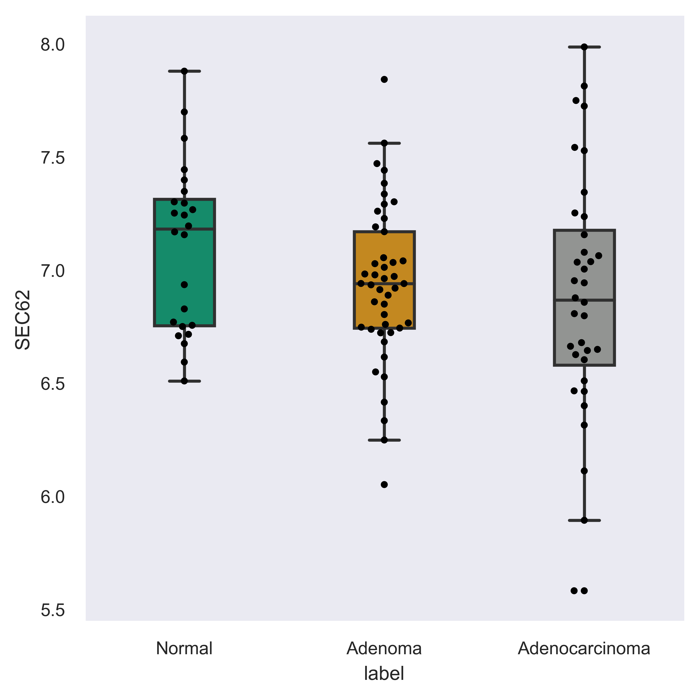

.. ident with TABs
.. code-block:: python

  >>> xp.gene_overview(data, metadata, 'CCL5', sample_colors, grid=True, whitegrid=True)

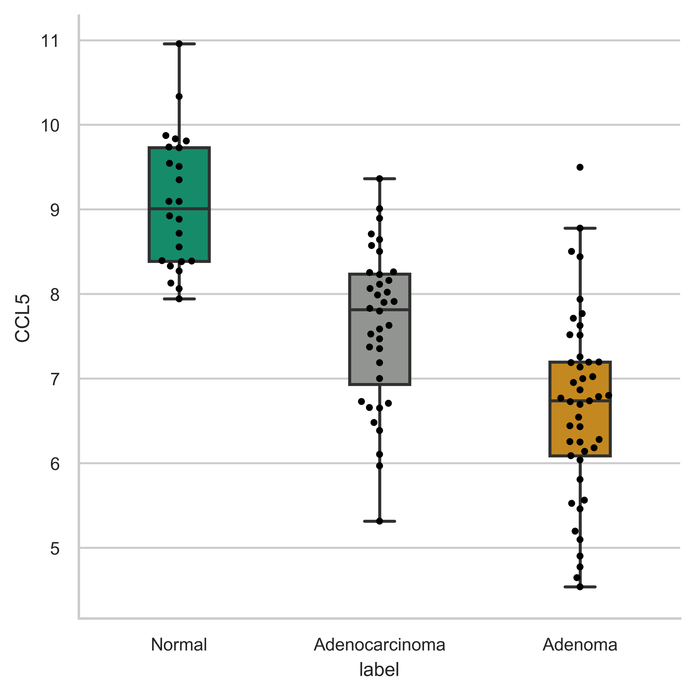

===============================
Multi-gene Analysis
===============================
| **xpressplot.multigene_overview ( data, info, palette=None, gene_list=None, order=None, scale=None, title=None, grid=False, whitegrid=False, save_fig=None, dpi=600, bbox_inches='tight' )**
|
| Purpose:
| Create violin plots of a subset of gene expressions or total gene expression by experiment group
|
| Assumptions:
|   - Dataframe and metadata are properly formatted for use with xpressplot
|
| Parameters:
| **data**: xpressplot-formatted dataframe (Required)
| **info**: xpressplot formatted sample info dataframe (Required)
| **palette**: Dictionary of matplotlib compatible colors for samples (Default: None)
| **gene_list**: List of genes to plot (default: None; plots total gene expression for experiment group)
| **order**: List of experiment groups in order to plot (Default: None)
| **scale**: Seaborn violinplot scale argument (default: 'area')
| **title**: Plot title (default: None)
| **grid**: Set to True to add gridlines (default: False)
| **whitegrid**: Set to True to create white background in figure (default: Grey-scale)
| **save_fig**: Full file path, name, and extension for file output (default: None)
| **dpi**: Set DPI for figure output (default: 600)
| **bbox_inches**: Matplotlib bbox_inches argument (default: 'tight'; useful for saving images and preventing text cut-off)
|
| Examples:

.. ident with TABs
.. code-block:: python

  >>> xp.multigene_overview(data, metadata, palette=sample_colors,
      gene_list=['SEC62','CCL5','STX6'])

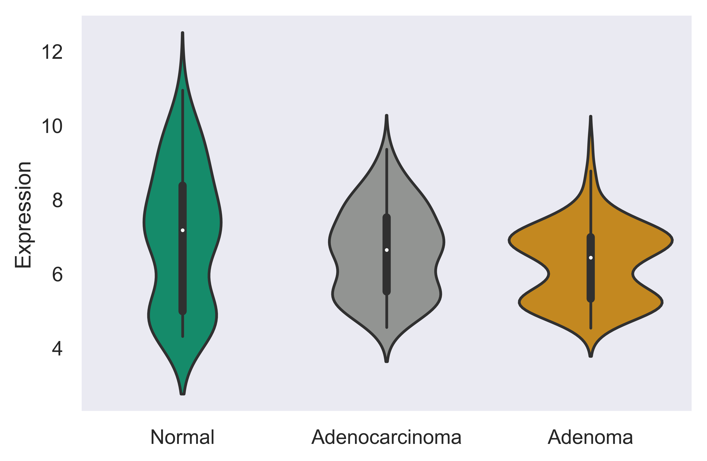

.. ident with TABs
.. code-block:: python

  >>> xp.gene_overview(data, metadata, palette=sample_colors, gene_list=['STX6'],
      order=['Normal','Adenoma','Adenocarcinoma'])

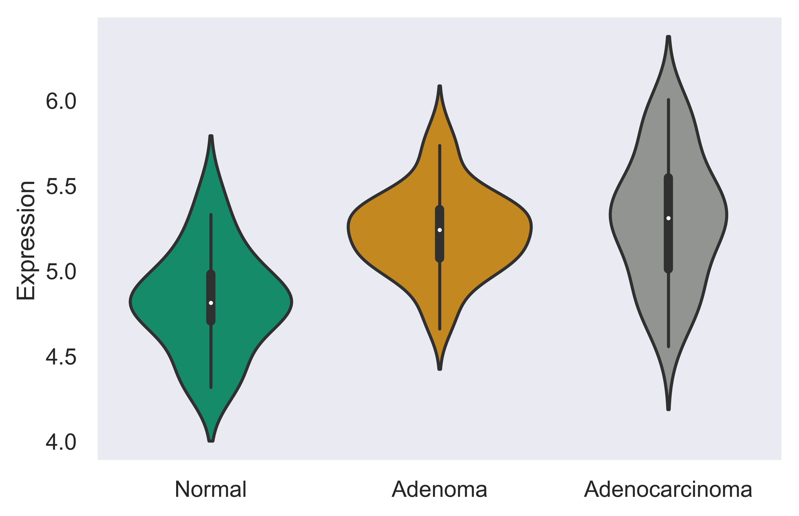

===============================
Heatmap
===============================
| **xpressplot.heatmap ( data, info, sample_palette=None, gene_info=None, gene_palette=None, gene_list=None, col_cluster=True, row_cluster=False, metric='euclidean', method='centroid', font_scale=0.8, cmap=jakes_cmap, center=0, xticklabels=True, yticklabels=True, linewidths=0, linecolor='#DCDCDC', cbar_kws=None, figsize=(16,6.5), save_fig=None, dpi=600, bbox_inches='tight' )**
|
| Purpose:
| Create clustered heatmaps for gene expression dataframe
|
| Assumptions:
|   - Dataframe and metadata are properly formatted for use with xpressplot
|
| Parameters:
| **data**: xpressplot-formatted dataframe (Required)
| **info**: xpressplot formatted sample info dataframe (Required)
| **sample_palette**: Dictionary of matplotlib compatible colors for samples (Default: None)
| **gene_info**: xpressplot formatted metadata matrix for genes (column0) and gene groups (column1)
| **gene_palette**: Dictionary of labels and colors for plotting, or valid seaborns clustermap col_colors option
| **gene_list**: List of genes to plot (default: None; plots total gene expression for experiment group)
| **col_cluster**: Cluster columns/samples (default: True)
| **row_cluster**: Cluster rows/genes (default: False)
| **metric**: Seaborn clustermap argument (default: 'euclidean')
| **method**: Seaborn clustermap argument (default: 'centroid')
| **font_scale**: Aspect by which to scale text (default: 0.8)
| **cmap**: Matplotlib colorbar valid entry (default: jakes_cmap; a color-blind friendly color palette)
| **center**: Value at which to center the color scale (default: 0)
| **xticklabels**: Include x-axis labels (default: True)
| **yticklabels**: Include y-axis labels (default: True)
| **linewidths**: Thickness of grid lines (default: 0; no grid-lines printed)
| **linecolor**: Grid line color (default: '#DCDCDC'; or white)
| **cbar_kw**: Matplotlib colorbar additional arguments (default: None)
| **figsize**: Figure size tuple; width, height (default: (16,6.5))
| **save_fig**: Full file path, name, and extension for file output (default: None)
| **dpi**: Set DPI for figure output (default: 600)
| **bbox_inches**: Matplotlib bbox_inches argument (default: 'tight'; useful for saving images and preventing text cut-off)
|
| Examples:

.. ident with TABs
.. code-block:: python

  >>> xp.heatmap(data, metadata, sample_palette=sample_colors, gene_list=['SEC62','STX6','CCL5'],
      cbar_kws={'label':'z-score'}, figsize=(20,2))

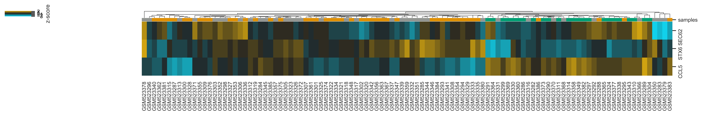

.. ident with TABs
.. code-block:: python

  >>> xp.heatmap(data, metadata, sample_palette=sample_colors, gene_palette=gene_colors,
      gene_info=gene_metadata, gene_list=['SEC62','STX6','CCL5'], figsize=(20,2),
      row_cluster=True)

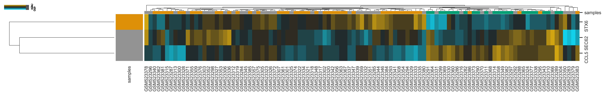

.. ident with TABs
.. code-block:: python

  >>> xp.heatmap(data, metadata, sample_palette=sample_colors, xticklabels=True, linewidths=.5,
      linecolor='black', gene_list=['SEC62','STX6','CCL5'], figsize=(20,2))

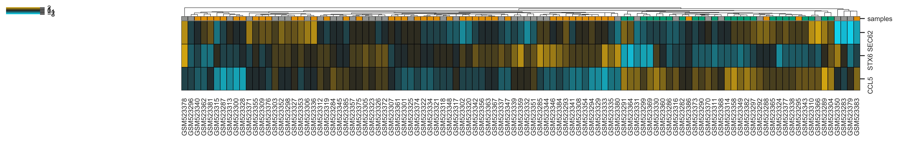

===============================
Scatterplot
===============================
| **xpressplot.scatter ( data, info, x, y, palette=None, add_linreg=False, order_legend=None, title=None, alpha=1, highlight_points=None, highlight_color='DarkRed', highlight_names=None, alpha_highlights=1, size=30, y_threshold=None, x_threshold=None, threshold_color='b', label_points=None, grid=False, whitegrid=False, save_fig=None, dpi=600, bbox_inches='tight' )**
|
| Purpose:
| Create scatterplot with the option to include a linear least-squares regression fit of the data
|
| Assumptions:
|   - Dataframe and metadata are properly formatted for use with xpressplot
|
| Parameters:
| **data**: xpressplot-formatted dataframe (Required)
| **info**: xpressplot formatted sample info dataframe (Required)
| **x**: X-axis gene or other metric (Required)
| **y**: Y-axis gene or other metric (Required)
| **palette**: Dictionary of matplotlib compatible colors for samples (Default: None)
| **add_linreg**: Add a linear least-squares regression line (default: False)
| **order_legend**: List of experiment groups in order to display on legend (Default: None)
| **title**: Plot title (default: None)
| **alpha**: Opacity percentage for scatter plot
| **highlight_points**: List of indices to highlight on scatterplot (if desired to plot multiple sets in different colors, lists of lists can be provided)
| **highlight_color**: Color or ordered list of colors to plot highlighted points (if multiple lists are being highlighted, pass colors in same order as a list)
| **highlight_names**: Ordered list of names to use in legend (must follow order provided for highlight_points and highlight_color)
| **alpha_highlights**: Opacity percentage for highlighted elements of scatter plot
| **size**: Marker size
| **y_threshold**: Include a y-axis threshold dotted line (default: None). If a list is provided, each will be plotted
| **x_threshold**: Include a x-axis threshold dotted line (default: None). If a list is provided, each will be plotted
| **threshold_color**: Threshold line color (default: 'b'; black)
| **label_points**: A dictionary where keys are labels and values are a two-element list as [x-coordinate, y-coordinate]
| **grid**: Set to True to add gridlines (default: False)
| **whitegrid**: Set to True to create white background in figure (default: Grey-scale)
| **save_fig**: Full file path, name, and extension for file output (default: None)
| **dpi**: Set DPI for figure output (default: 600)
| **bbox_inches**: Matplotlib bbox_inches argument (default: 'tight'; useful for saving images and preventing text cut-off)
|
| Examples:

.. ident with TABs
.. code-block:: python

  >>> xp.scatter(data, metadata, 'SEC62', 'STX6', palette=geo_colors, add_linreg=True,
      order_legend=[1,3,2], alpha=.7)

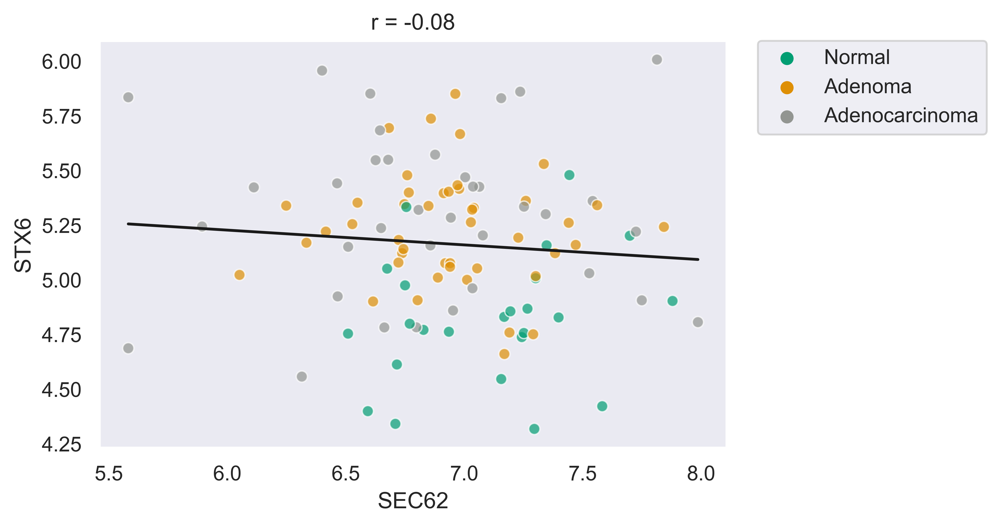

.. ident with TABs
.. code-block:: python

  >>> xp.scatter(data, metadata, 'SEC62', 'STX6', palette=geo_colors, add_linreg=False, alpha=.7)

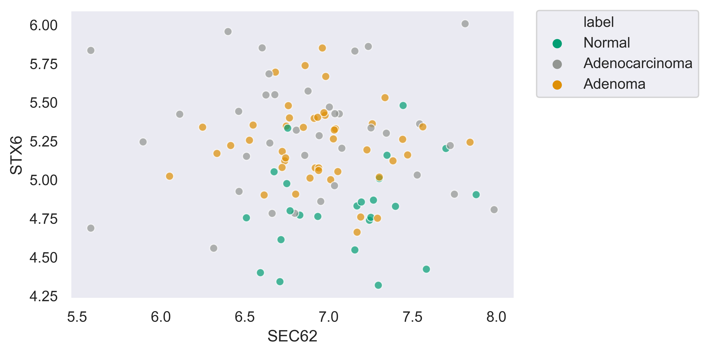

.. ident with TABs
.. code-block:: python

  >>> xp.scatter(data, metadata, 'SEC62', 'STX6', palette=geo_colors, add_linreg=True, alpha=.2,
      title='this is a title', y_threshold=5, x_threshold=[7])

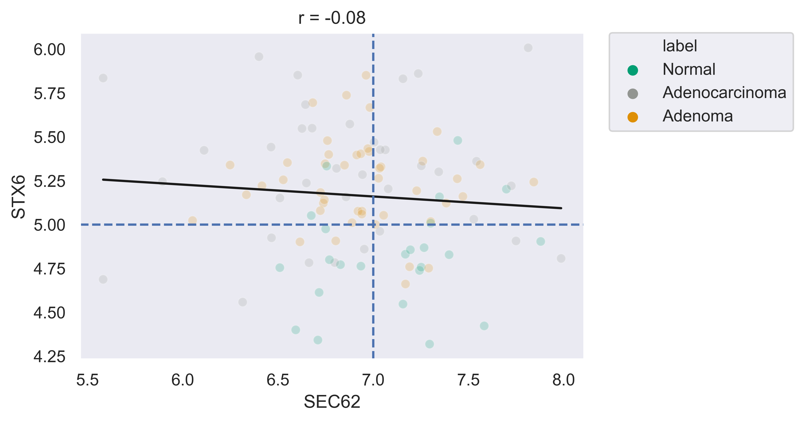

===============================
Volcano Plot
===============================
| **xpressplot.volcano ( data, info, label_comp, label_base, order_legend=None, title=None, alpha=1, highlight_points=None, highlight_color='DarkRed', highlight_names=None,  alpha_highlights=1, size=30, y_threshold=None, x_threshold=None, threshold_color='b', save_threshold_hits=None, save_threshold_hits_delimiter=',', label_points=None, grid=False, whitegrid=False, return_data=False, plotly_login=False, save_fig=None, dpi=600, bbox_inches='tight' )**
|
| Purpose:
| Create scatterplot with the option to include a linear least-squares regression fit of the data
|
| Assumptions:
|   - Dataframe and metadata are properly formatted for use with xpressplot
|
| Parameters:
| **data**: xpressplot-formatted dataframe, sample normalized (Required)
| **info**: xpressplot formatted sample info dataframe (Required)
| **label_comp**: Experiment group name to act as comparison group (Required)
| **label_base**: Experiment group name to act as base group (Required)
| **order_legend**: List of experiment groups in order to display on legend (Default: None)
| **title**: Plot title (default: None)
| **alpha**: Opacity percentage for scatter plot
| **highlight_points**: List of indices to highlight on scatterplot (if desired to plot multiple sets in different colors, lists of lists can be provided)
| **highlight_color**: Color or ordered list of colors to plot highlighted points (if multiple lists are being highlighted, pass colors in same order as a list)
| **highlight_names**: Ordered list of names to use in legend (must follow order provided for highlight_points and highlight_color)
| **alpha_highlights**: Opacity percentage for highlighted elements of scatter plot
| **size**: Marker size
| **y_threshold**: Include a y-axis threshold dotted line (default: None). If a list is provided, each will be plotted
| **x_threshold**: Include a x-axis threshold dotted line (default: None). If a list is provided, each will be plotted
| **threshold_color**: Threshold line color (default: 'b'; black)
| **save_threshold_hits**: Include path and filename to save points out of bounds of the threshold points (greater than the Y-threshold, and outside of the X-threshold range)
| **save_threshold_hits_delimiter**: Delimiter to use for saving threshold hits (default: ','; .csv)
| **label_points**: A dictionary where keys are labels and values are a two-element list as [x-coordinate, y-coordinate]
| **grid**: Set to True to add gridlines (default: False)
| **whitegrid**: Set to True to create white background in figure (default: Grey-scale)
| **return_data**: Set as True to return dataframe with log2 Fold Changes and -log10 P-values added
| **plotly_login**: Include plotly login username and password to create an interactive plot, ex: ['username','password']
| **save_fig**: Full file path, name, and extension for file output (default: None)
| **dpi**: Set DPI for figure output (default: 600)
| **bbox_inches**: Matplotlib bbox_inches argument (default: 'tight'; useful for saving images and preventing text cut-off)
|
| Examples:

.. ident with TABs
.. code-block:: python

  >>> xp.volcano(data, metadata, 'Adenoma', 'Normal', highlight_points=['STX6','SCARB1','CCL5'])

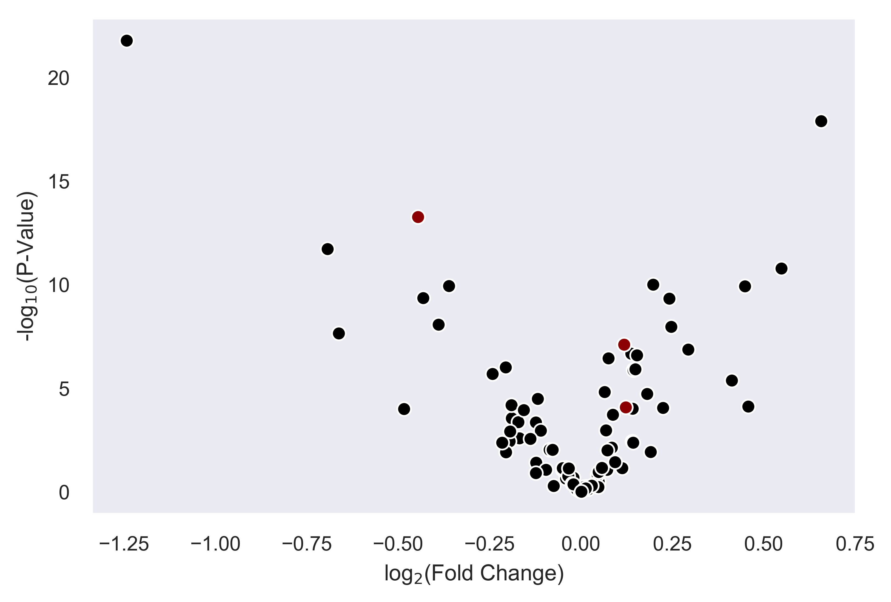

.. ident with TABs
.. code-block:: python

  >>> xp.volcano(data, metadata, 'Adenoma', 'Normal', highlight_points=['STX6','SCARB1','CCL5'],
      y_threshold=2, x_threshold=[-1,1], save_threshold_hits=save_threshold)

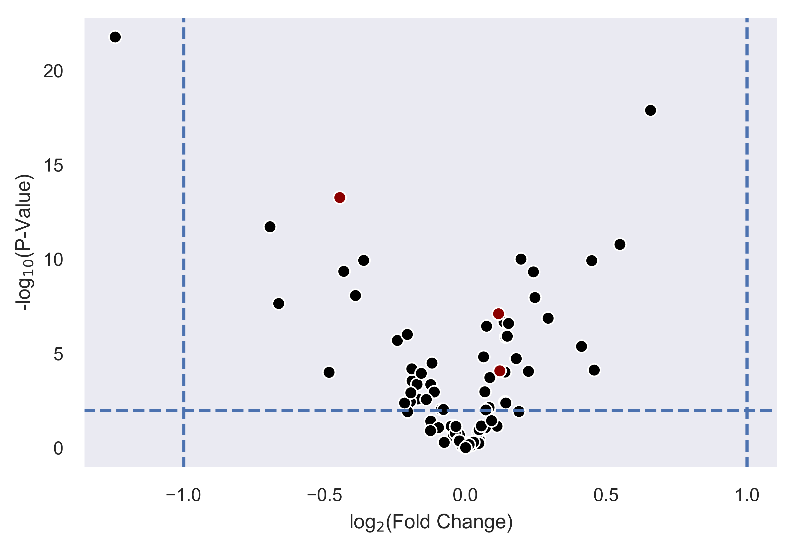

.. ident with TABs
.. code-block:: python

  >>> xp.volcano(data, metadata, 'Adenoma', 'Normal', highlight_points=[['STX6','SCARB1','CCL5'],['BEST4']],
      highlight_color=['blue','red'], alpha=.3, y_threshold=2, x_threshold=[-1,1],
      label_points={'BEST4':[-1.24288077425345,21.782377963035827]})

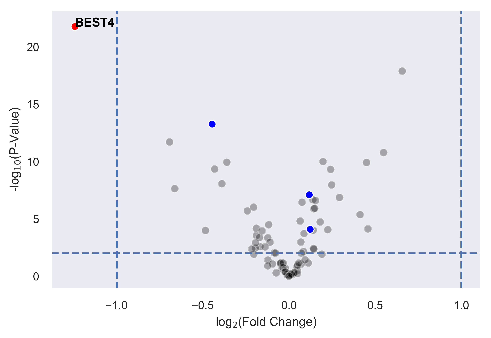

===============================
Linear Regression
===============================
| **xpressplot.linreg ( data, gene_name, save_file, delimiter=',' )**
|
| Purpose:
| Calculate r, r^2 values, and p-values for every gene against target gene for given dataset
|
| Assumptions:
|   - Dataframe is properly formatted for use with xpressplot
|
| Parameters:
| **data**: xpressplot-formatted dataframe, sample normalized (Required)
| **gene_name**: Target gene name to run genome-wide comparisons against
| **save_file**: Full file path, name, and extension for file output (default: None)
| **delimiter**: Field separator for output file (default: ',')
|
| Examples:

.. ident with TABs
.. code-block:: python

  >>> xp.linreg(data, 'STX6', 'path/to/output.csv', delimiter=',')

===============================
Jointplot
===============================
| **xpressplot.jointplot ( data, info, x, y, kind='reg', palette=None, order=None, title_pad=0, title_pos='right', grid=False, whitegrid=False, save_fig=None, dpi=600, bbox_inches='tight' )**
|
| Purpose:
| Create linear regression scatterplot that displays r value, confidence, and density distributions for axes
|
| Assumptions:
|   - Dataframe and metadata are properly formatted for use with xpressplot
|
| Parameters:
| **data**: xpressplot-formatted dataframe (Required)
| **info**: xpressplot formatted sample info dataframe (Required)
| **x**: X-axis gene or other metric (Required)
| **y**: Y-axis gene or other metric (Required)
| **kind**: Type of plot to create from the seaborns jointplot function (default: 'reg'; linear regression)
| **palette**: Dictionary of matplotlib compatible colors for samples (Default: None)
| **order**: List of experiment groups in order to display on legend (Default: None)
| **title_pad**: Amount of padding to give title from default position (default: 0)
| **title_pos**: Title position (default: 'right'; other options: 'center', 'left')
| **grid**: Set to True to add gridlines (default: False)
| **whitegrid**: Set to True to create white background in figure (default: Grey-scale)
| **save_fig**: Full file path, name, and extension for file output (default: None)
| **dpi**: Set DPI for figure output (default: 600)
| **bbox_inches**: Matplotlib bbox_inches argument (default: 'tight'; useful for saving images and preventing text cut-off)
|
| Examples:

.. ident with TABs
.. code-block:: python

  >>> xp.jointplot(geo_labeled, meta, 'STX6', 'STX6', kind='reg')

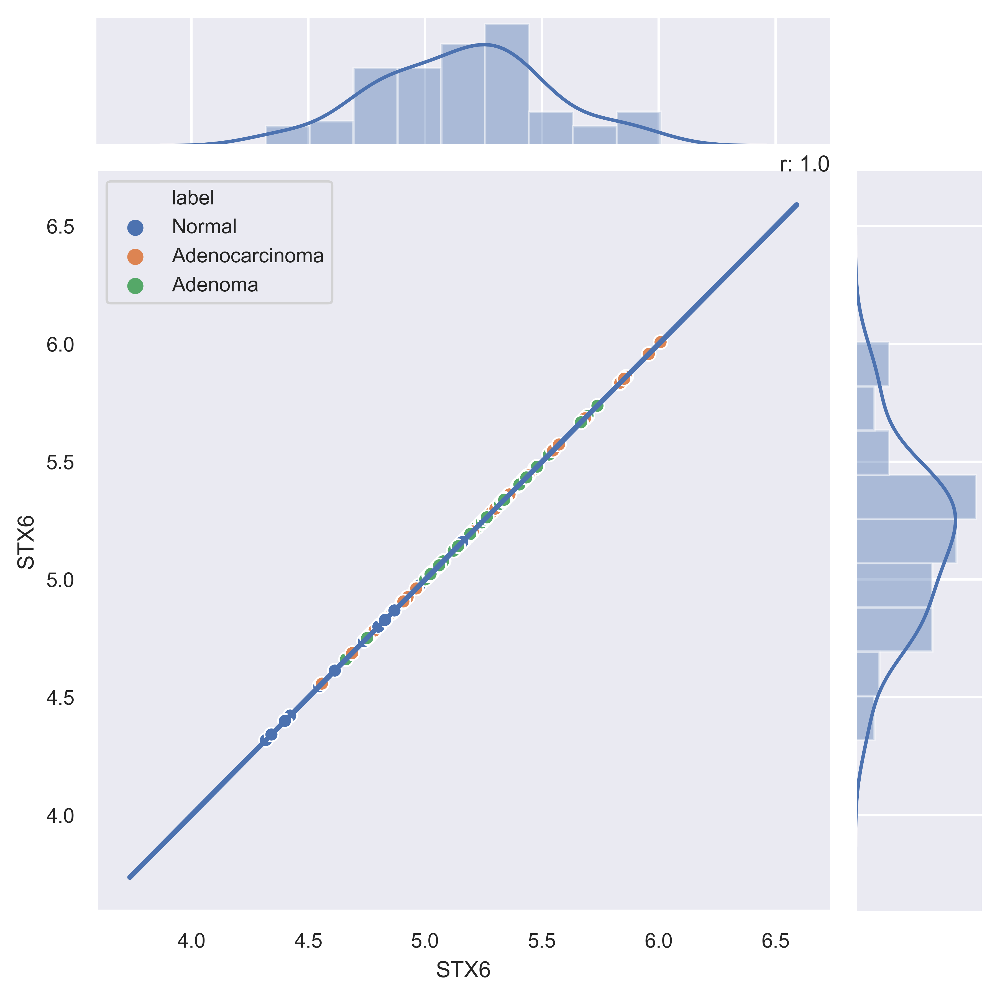

.. ident with TABs
.. code-block:: python

  >>> xp.jointplot(geo_labeled, meta, 'STX6', 'CCL5', kind='reg', palette=geo_colors,
      order=['Normal','Adenoma','Adenocarcinoma'], title_pad=-305, title_pos='center')

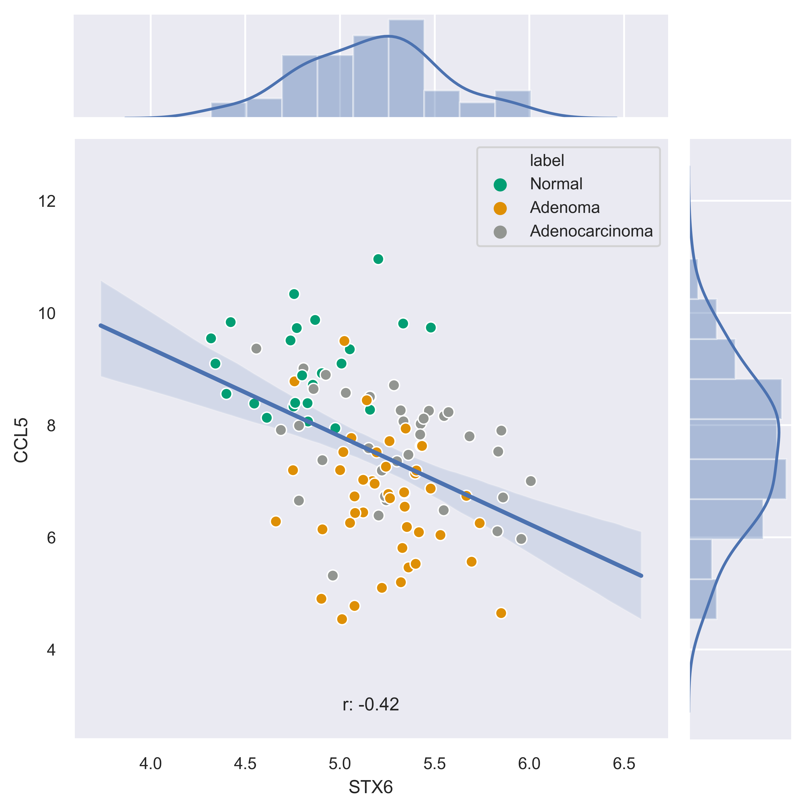

.. ident with TABs
.. code-block:: python

  >>> xp.jointplot(geo_labeled, meta, 'STX6', 'CCL5', kind='kde', palette=geo_colors,
      order=['Normal','Adenoma','Adenocarcinoma'])

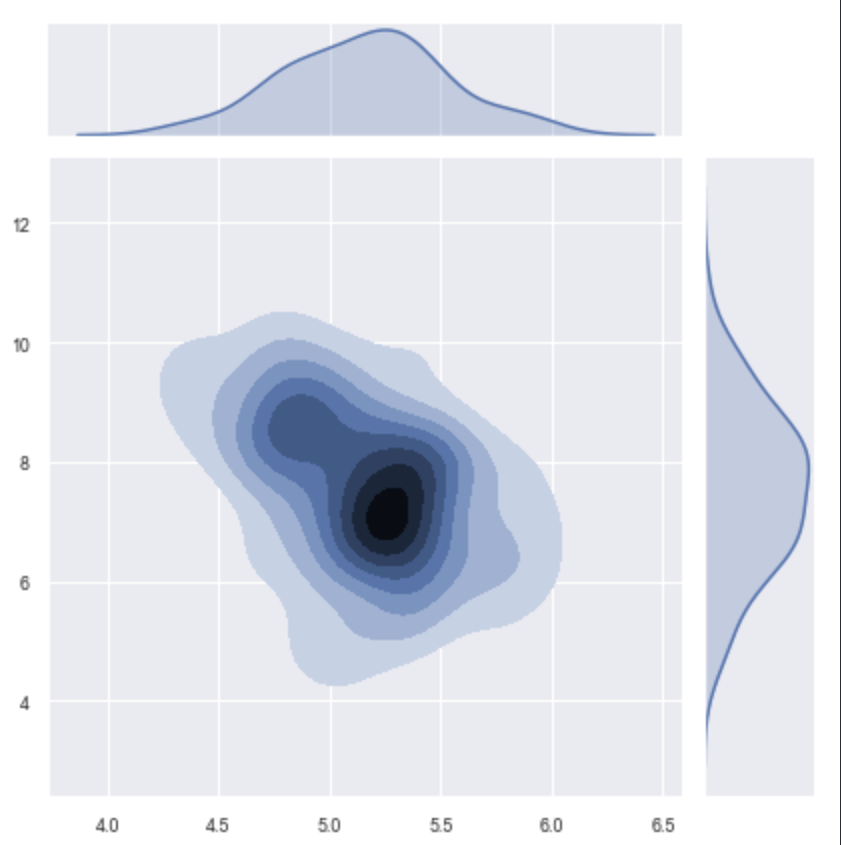

===============================
PCA (2-D, 3-D, Interactive)
===============================
| **xpressplot.pca ( data, info, palette, grouping='samples', gene_list=None, gene_labels=False, _3d_pca=False, principle_components=[1,2], n_components=10, ci=2, scree_only=False, save_scree=False, size=30, order_legend=None, title=None, fig_size=(10,10), grid=False, whitegrid=False, save_fig=None, dpi=600, bbox_inches='tight', return_pca=False, plotly_login=None )**
|
| Purpose:
| Plot a 2-D PCA with confidence intervals or a 3-D PCA with no confidence intervals
|
| Assumptions:
|   - Dataframe and metadata are properly formatted for use with xpressplot
|
| Parameters:
| **data**: xpressplot-formatted dataframe, sample normalized (Required)
| **info**: xpressplot formatted sample info dataframe (Required)
| **palette**: Dictionary of matplotlib compatible colors for samples (Default: None)
| **grouping**: What axis of the data to perform the analysis (default: 'samples' or columns; other options: 'genes', not yet implemented)
| **gene_list**: List of genes to perform PCA across
| **gene_labels**: Option for grouping='genes', not currently implemented
| **_3d_pca**: Set to True to create 3-D PCA plotting principle components 1-3 (default: False)
| **principle_components**: List of principle components to plot for 2-D PCA
| **n_components**: Number of components to evaluate in the general analysis
| **ci**: Confidence intervals to plot (i.e. 1 == CI1 == 68%, 2 == CI2 == 95%, 3 == CI3 == 99%)
| **scree_only**: Only evaluate scree plot for n_components and exit
| **save_scree**: Output scree plot to path and filename (automatically appends '_scree.pdf')
| **size**: Marker size
| **order_legend**: List of experiment groups in order to display on legend (Default: None)
| **title**: Plot title (default: None)
| **fig_size**: Figure size tuple; width, height (default: (16,6.5))
| **grid**: Set to True to add gridlines (default: False)
| **whitegrid**: Set to True to create white background in figure (default: Grey-scale)
| **save_fig**: Full file path, name, and extension for file output (default: None)
| **dpi**: Set DPI for figure output (default: 600)
| **bbox_inches**: Matplotlib bbox_inches argument (default: 'tight'; useful for saving images and preventing text cut-off)
| **return_pca**: Set as True to return dataframe with principle component values added
| **plotly_login**: Include plotly login username and password to create an interactive plot, ex: ['username','password'] -- not yet implemented
|
| Notes:
|   - Exporting 3-D static PCA plots is not currently supported
|
| Examples:

.. ident with TABs
.. code-block:: python

  >>> xp.pca(geo_labeled, meta, geo_colors, grouping='samples', gene_list=None, gene_labels=False,
      ci=2, principle_components=[1,2], n_components=10, _3d_pca=False, scree_only=False,
      save_scree=None, size=10)

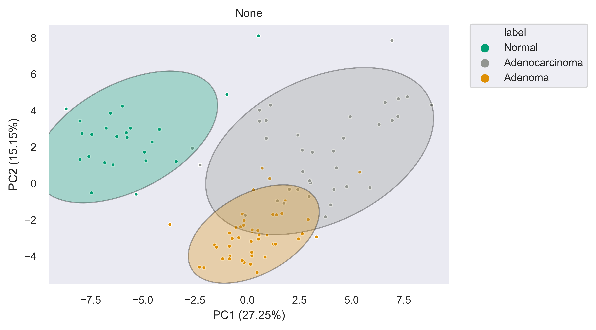

.. ident with TABs
.. code-block:: python

  >>> xp.pca(geo_labeled, meta, geo_colors, _3d_pca=True, order_legend=[1,3,2], save_fig=pca_file)

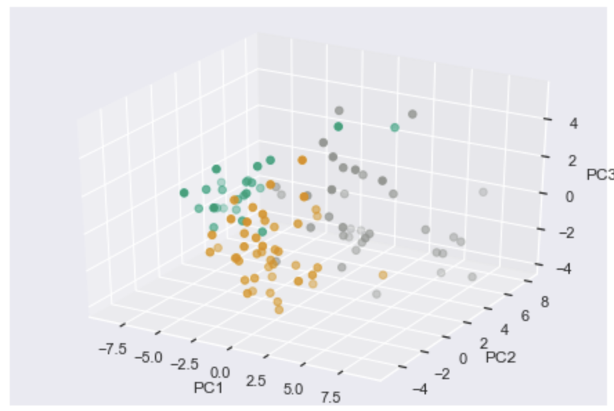

.. ident with TABs
.. code-block:: python

  >>> xp.pca(geo_labeled, meta, geo_colors, _3d_pca=False, scree_only=True, save_scree=True)

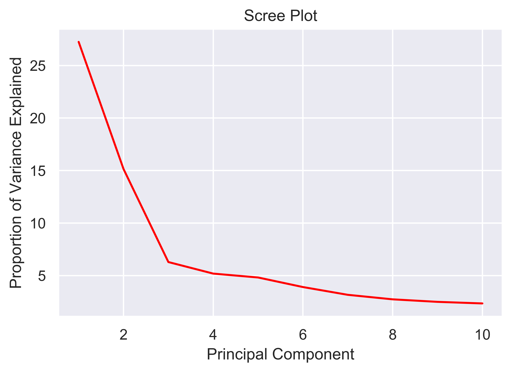
