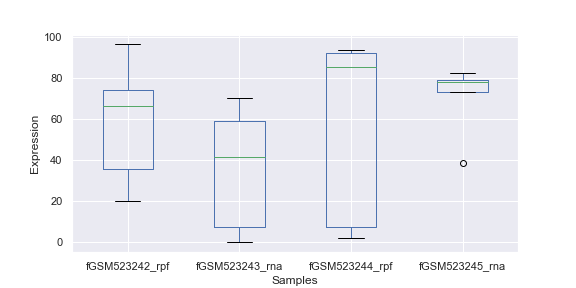

#################################
Normalization and Quality Control
#################################

=======================
RPM (Reads per Million)
=======================
| **xpresstools.rpm ( data )**
|
| Purpose:
| Perform reads per million sample normalization on RNAseq data
|
| Formula:
| :math:`RPM = \frac{\#\ number\ reads\ per\ gene\ x\ 1e6}{\#\ mapped\ reads\ per\ sample}`
|
| Assumptions:
|   - Dataframe contains raw count data, where samples are along columns and genes across rows
|
| Parameters:
| **data**: Input dataframe with counts values
|
| Returns:
| **data_rpm**: Pandas dataframe with RPM-normalized
|
| Examples:

.. ident with TABs
.. code-block:: python

  > data
        fGSM523242  fGSM523243  fGSM523244  fGSM523245  fGSM523246
  Gene1 66          59          1           82          45
  Gene2 35          0           7           72          2
  Gene3 20          70          85          78          36
  Gene4 96          7           93          38          85
  Gene5 73          41          92          77          26
  > data = xp.rpm(data)
  > data
        fGSM523242  fGSM523243  fGSM523244  fGSM523245  fGSM523246
  Gene1 227586.2069 333333.3333 3597.1223   236311.2392 231958.7629
  Gene2 120689.6552 0.0000      25179.8561  207492.7954 10309.2784
  Gene3 68965.5172  395480.2260 305755.3957 224783.8617 185567.0103
  Gene4 331034.4828 39548.0226  334532.3741 109510.0865 438144.3299
  Gene5 251724.1379 231638.4181 330935.2518 221902.0173 134020.6186

==============================================
R/FPKM (Reads/Fragments per Kilobase Million)
==============================================
| **xpresstools.r_fpkm ( data, gtf, gene_name_prefix='gene_id \"', gene_name_location=0, sep='\t' )**
|
| Purpose:
| Perform reads/fragments per kilobase million sample normalization on RNAseq data
|
| Formulae:
| :math:`RPKM = \frac{\#\ number\ reads\ per\ gene\ x\ 1e6\ x\ 1e3}{\#\ mapped\ reads\ per\ sample\ x\ gene\ length\ (bp)}`
|
| :math:`FPKM = \frac{\#\ number\ fragments\ per\ gene\ x\ 1e6\ x\ 1e3}{\#\ mapped\ fragments\ per\ sample\ x\ gene\ length\ (bp)}`
|
| Assumptions:
|   - Dataframe contains raw count data, where samples are along columns and genes across rows
|
| Parameters:
| **data**: Input dataframe with counts values
| **gtf**: GTF reference file path and name
| **gene_name_prefix**: Label of original name (usually \"gene_name \"), must match the gene naming type in the input dataframe
| **gene_name_location**: Position in last column of GTF where relevant data is found (i.e. 0 would be the first sub-string before the first comma, 3 would be the third sub-string after the second comma before the third comma)
| **sep**: GTF delimiter (usually tab-delimited)
|
| Returns:
| **data_rpkm**: Pandas dataframe with R/FPKM-normalized
|
| Examples:

.. ident with TABs
.. code-block:: python

  > data
        fGSM523242  fGSM523243  fGSM523244  fGSM523245  fGSM523246
  Gene1 66          59          1           82          45
  Gene2 35          0           7           72          2
  Gene3 20          70          85          78          36
  Gene4 96          7           93          38          85
  Gene5 73          41          92          77          26
  > data = xp.r_fpkm(data, '/path/to/transcripts.gtf')
  > data
        fGSM523242  fGSM523243  fGSM523244  fGSM523245  fGSM523246
  Gene1 15006.3436  21978.9881  237.1833    15581.6457  15294.6567
  Gene2 18516.3632  0.0000      3863.1261   31833.8133  1581.6628
  Gene3 1552.2985   8901.5987   6882.0428   5059.5089   4176.8031
  Gene4 10220.8992  1221.0702   10328.8988  3381.1932   13527.9835
  Gene5 12188.2602  11215.7274  16023.5923  10744.2995  6489.1599

===========================
TE (Translation Efficiency)
===========================
| **xpresstools.te ( data, samples=None, log2=True )**
|
| Purpose:
| Transform paired ribosome footprint and RNA samples to translation efficiency measures
|
| Formulae:
| :math:`log_2TE = log_2(\frac{RPF\ reads\ per\ gene}{total\ RNA\ reads\ per\ gene})`
|
| Assumptions:
|   - Dataframe contains normalized count data, where samples are along columns and genes across rows (unless otherwise desired)
|
| Parameters:
| **data**: Input dataframe with counts values
| **samples**: GTF reference file path and name
| **log2**: Label of original name (usually \"gene_name \"), must match the gene naming type in the input dataframe
|
| Returns:
| **data_te**: Pandas dataframe TE transformed
|
| Examples:

.. ident with TABs
.. code-block:: python

  > data
                  s1_rpf  s1_rna  s2_rpf  s2_rna
  ENSG00000227232 66.34   59.13   1.90    82.49
  ENSG00000240361 35.73   0.00    7.38    72.94
  ENSG00000238009 20.02   70.21   85.10   78.87
  ENSG00000241860 96.23   7.49    93.49   38.39
  ENSG00000187634 73.91   41.28   92.27   77.93
  > te_data = xp.te(data, samples=['sample1','sample2'])
  > te_data
                  sample1 sample2
  ENSG00000227232 0.1657  -5.3679
  ENSG00000240361 8.4850  -3.2876
  ENSG00000238009 -1.8051 0.1095
  ENSG00000241860 3.6658  1.2819
  ENSG00000187634 0.8388  0.2434
  > te_data = xp.te(data)
  > te_data
                  s1_rpf_te s2_rpf_te
  ENSG00000227232 0.1657    -5.3679
  ENSG00000240361 8.4850    -3.2876
  ENSG00000238009 -1.8051   0.1095
  ENSG00000241860 3.6658    1.2819
  ENSG00000187634 0.8388    0.2434

===========================
Log transformation
===========================
| **xpresstools.log_scale ( data, log_base=10 )**
|
| Purpose:
| Log-scale a sample-normalized dataframe
|
| Assumptions:
|   - Requires a properly formatted dataframe for XPRESStools usage
|
| Parameters:
| **data**: Input dataframe with counts values
| **log_base**: Log base to use for transformation (default: 10; or 2)
|
| Returns:
| **data_log**: Pandas dataframe log-scaled
|
| Examples:

.. ident with TABs
.. code-block:: python

  > data
                  s1_rpf  s1_rna  s2_rpf  s2_rna
  ENSG00000227232 66.34   59.13   1.90    82.49
  ENSG00000240361 35.73   0.00    7.38    72.94
  ENSG00000238009 20.02   70.21   85.10   78.87
  ENSG00000241860 96.23   7.49    93.49   38.39
  ENSG00000187634 73.91   41.28   92.27   77.93
  > log_data = xp.log_scale(data)
  > log_data
                  s1_rpf    s1_rna    s2_rpf    s2_rna
  ENSG00000227232 1.822430  1.772542  0.301030  1.916927
  ENSG00000240361 1.554247  -1.000000 0.873902  1.863561
  ENSG00000238009 1.303628  1.847017  1.930440  1.897462
  ENSG00000241860 1.983762  0.880242  1.971229  1.585348
  ENSG00000187634 1.869290  1.616790  1.965531  1.892262

=====================
Batch Normalize
=====================
| **xpresstools.batch_normalize ( input_file, batch_file, output_file, input_sep=',', batch_sep=',' )**
|
| Purpose:
| Control for batch effects between datasets
|
| Assumptions:
|   - Requires a properly formatted dataframe for XPRESStools usage where samples are normalized previously if desired
|   - Requires a properly formatted dataframe complying to SVA COMBAT info file (see example below)
|   - R is installed on your machine and is in your $PATH
|
| Parameters:
| **input_file**: Input dataframe file with values (can be normalized or unnormalized)
| **batch_file**: Input dataframe containing batch effect information, column naming convention must be followed and *is* case-sensitive
| **output_file**: Output path and file name for batch normalized data
| **input_sep**: Delimiter for input_file
| **batch_sep**: Delimiter for batch_file
|
| Examples:

.. ident with TABs
.. code-block:: python

  > data = pd.read_csv('/path/to/expression.csv', index_col=0)
  > data
                  s1_rpf  s1_rna  s2_rpf  s2_rna
  ENSG00000227232 66.34   59.13   1.90    82.49
  ENSG00000240361 35.73   0.00    7.38    72.94
  ENSG00000238009 20.02   70.21   85.10   78.87
  ENSG00000241860 96.23   7.49    93.49   38.39
  ENSG00000187634 73.91   41.28   92.27   77.93
  > batch = pd.read_csv('/path/to/batch_info.csv', index_col=0)
  > batch
    Sample  Batch
  0 s1_rpf  batch1
  1 s1_rna  batch2
  2 s2_rpf  batch1
  3 s2_rna  batch2
  > xp.batch_normalize('/path/to/expression.csv', '/path/to/batch_info.csv')

====================
Clean dataset
====================
| **xpresstools.clean_df ( data, axis=0 )**
|
| Purpose:
| Cleans NULL values from axis and clears duplicate indices
|
| Assumptions:
|   - Requires a properly formatted dataframe for XPRESStools usage
|
| Parameters:
| **data**: Input dataframe file with values (can be normalized or unnormalized)
| **axis**: Axis to clean NaN values from (default: 0, which corresponds to rows)
|
| Returns:
| **data_clean**: Cleaned pandas dataframe
|
| Examples:

.. ident with TABs
.. code-block:: python

  > data
                  s1_rpf  s1_rna  s2_rpf  s2_rna
  ENSG00000227232 66.34   59.13   1.90    NA
  ENSG00000240361 35.73   0.00    7.38    72.94
  Gene2           20.02   70.21   85.10   78.87
  Gene2           96.23   7.49    93.49   38.39
  ENSG00000187634 73.91   NA      92.27   77.93
  > data = xp.clean_df(data)
  > data
                  s1_rpf  s1_rna  s2_rpf  s2_rna
  ENSG00000240361 35.73   0.00    7.38    72.94

========================
Set Gene Threshold
========================
| **xpresstools.threshold ( data, minimum=None, maximum=None )**
|
| Purpose:
| Cleans gene axis (assumed to by rows) of genes containing values below or above user-determined thresholds
|
| Assumptions:
|   - Requires a properly formatted dataframe for XPRESStools usage
|
| Parameters:
| **data**: Input dataframe file with values (can be normalized or unnormalized)
| **minimum**: Minimum value all samples need of a given gene to avoid dropping across all samples
| **maximum**: Maximum value all samples can have of a given gene to avoid dropping across all samples
|
| Returns:
| **data_clean**: Cleaned pandas dataframe
|
| Examples:

.. ident with TABs
.. code-block:: python

  > data
                  s1_rpf  s1_rna  s2_rpf  s2_rna
  ENSG00000227232 66.34   59.13   1.90    82.49
  ENSG00000240361 35.73   0.00    7.38    72.94
  ENSG00000238009 20.02   70.21   85.10   78.87
  ENSG00000241860 96.23   7.49    93.49   38.39
  ENSG00000187634 73.91   41.28   92.27   77.93
  > data = xp.threshold(data, minimum=5)
  > data
                  s1_rpf  s1_rna  s2_rpf  s2_rna
  ENSG00000238009 20.02   70.21   85.10   78.87
  ENSG00000241860 96.23   7.49    93.49   38.39
  ENSG00000187634 73.91   41.28   92.27   77.93

================================
Prepare XPRESStools dataset
================================
| **xpresstools.prep_data ( data, info, gene_scale=True, print_means=False )**
|
| Purpose:
| Prepare dataframe for downstream analyses
|
| Assumptions:
|   - Requires a properly formatted dataframe for XPRESStools usage (genes as rows, samples as columns)
|   - Requires properly formatted XPRESStools metadata dataframe
|
| Parameters:
| **data**: XPRESStools formatted dataframe of expression values
| **info**: XPRESStools formatted sample info dataframe
| **gene_scale**: Scale genes (rows) of data
| **print_means**: Print means for each sample verification
|
| Returns:
| **data_normalized**: Normalized pandas dataframe
| **data_labeled**: Labeled pandas dataframe

=====================================
Check Sample Expression Distributions
=====================================
| **xpresstools.check_samples ( data )**
|
| Purpose:
| Visualize gene expression distributions on a sample-by-sample basis
|
| Assumptions:
|   - Requires a properly formatted dataframe for XPRESStools usage
|
| Parameters:
| **data**: Input dataframe file with values (can be normalized or unnormalized)
|
| Returns:
| Boxplot with samples on the x-axis and lump expression distributions for all genes in that sample
|
| Examples:

.. ident with TABs
.. code-block:: python

  > xp.check_samples(data)

